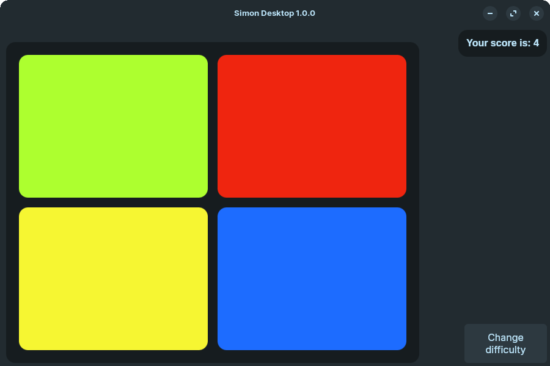

Desktop version of the orignal Simon toy, created with Tauri.

Theme heavily based on the [Zorin OS](https://zorin.com/os/) ZorinBlue-Dark gtk theme

# Build instructions
To build you'll have to have tauri setup on your system by going through [this page](https://v2.tauri.app/start/prerequisites/)
    
## For Linux builds
You must be running Linux/wsl to compile, either that or use something like docker or github actions
    
Create the node project\
`npm install`
    
Now build the project\
`npm run tauri build`

The .deb will be located in `/src-tauri/target/release/bundle/deb/`\
The .rpm will be located in `/src-tauri/target/release/bundle/rpm/`\ 
The .appimage will be located in `/src-tauri/target/release/bundle/appimage/`
The portable tar.gz will be located at `src-tauri/target/release/simon-desktop`

## For Windows builds
Like with the Linux builds, you have to be running Windows or something like docker or github actions
    
Create the node project\
`npm install`
    
Now build the project\
`npm run tauri build`

The .exe installer will be located in `/src-tauri/target/release/bundle/nsis/`\
The portable .exe version will be located in `/src-tauri/target/release/`, only the .exe is needed.
    

## For MacOS builds
I don't have a mac. if you wanna make your own builds go ahead but i aint doin it.